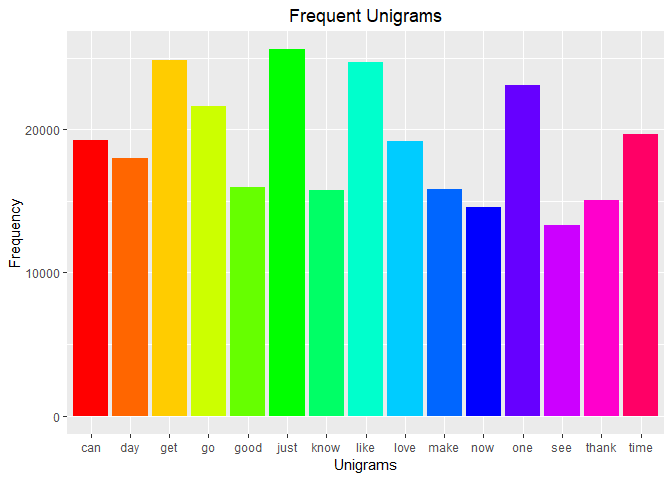
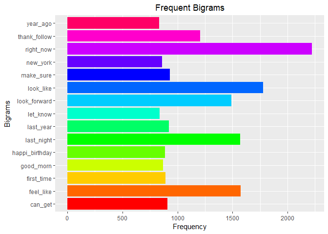
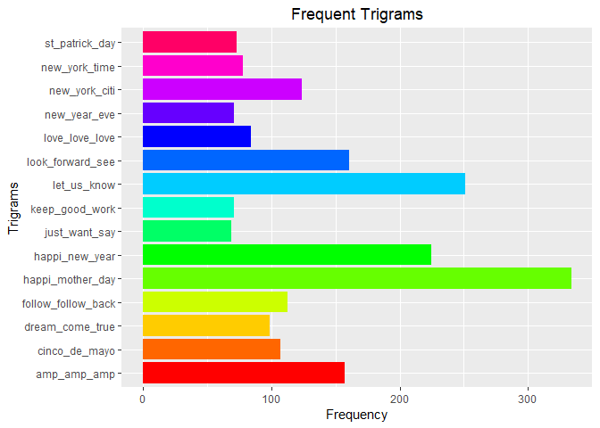

##Introduction

A large corpus of text will be used to explore Natural Language Processing (NLP). This report addresses cleaning the data in the corpus and exploratory data analysis.

##Load the Data

The following libraries will be used to clean and explore the corpus.


```r
suppressMessages(library(stringi))
suppressMessages(library(dplyr))
suppressMessages(library(stringr))
suppressMessages(library(ggplot2))
suppressMessages(library(tm))
suppressMessages(library(quanteda))
```

The corpa were collected from publicly available sources by a webcrawler. The data is stored in the following text files:

* en_US.blogs.txt
* en_US.news.txt
* en_US.twitter.txt


```r
blogs_data<-readLines("final/en_US/en_US.blogs.txt", encoding = "UTF-8", skipNul = TRUE)
news_data<-readLines("final/en_US/en_US.news.txt", encoding = "UTF-8", skipNul = TRUE, warn = FALSE)
twitter_data<-readLines("final/en_US/en_US.twitter.txt", encoding = "UTF-8", skipNul = TRUE)
```

##Preliminary Aspects of the Data

The following aspects of the data will help us understand the data with which we are working.


```r
data.frame("TextDocument" = c("Blogs", "News", "Twitter"),
           "Lines" = c(length(blogs_data), length(news_data), length(twitter_data)),
           "Words" = c(stri_stats_latex(blogs_data)[4], stri_stats_latex(news_data)[4],
                       stri_stats_latex(twitter_data)[4]),
           "MaxWords" = c(max(lengths(strsplit(blogs_data, " "))), max(lengths(strsplit(news_data, " "))),
                          max(lengths(strsplit(twitter_data, " ")))),
           "AverageWords" = c(mean(lengths(strsplit(blogs_data, " "))),
                              mean(lengths(strsplit(news_data, " "))),
                              mean(lengths(strsplit(twitter_data, " ")))),
           "Characters" = c(sum(nchar(blogs_data)), sum(nchar(news_data)), sum(nchar(twitter_data))),
           "MaxCharacters" = c(max(nchar(blogs_data)), max(nchar(news_data)), max(nchar(twitter_data))),
           "AverageChar" = c(mean(nchar(blogs_data)), mean(nchar(news_data)),
                             mean(nchar(twitter_data)))
           )
```

```
##   TextDocument   Lines    Words MaxWords AverageWords Characters
## 1        Blogs  899288 37570839     6630     41.51521  206824505
## 2         News   77259  2651432     1031     34.22215   15639408
## 3      Twitter 2360148 30451170       47     12.86936  162096241
##   MaxCharacters AverageChar
## 1         40833   229.98695
## 2          5760   202.42830
## 3           140    68.68054
```

##Process the Data

###Sample the Data

Due to the size of the files, we will sample 1% of the lines from each file.


```r
set.seed(3878)
blogs_data<-sample(blogs_data, size = length(blogs_data) * 0.1)
news_data<-sample(news_data, size = length(news_data) * 0.1)
twitter_data<-sample(twitter_data, size = length(twitter_data) * 0.1)

data.frame("TextDocument" = c("Blogs", "News", "Twitter"),
           "Lines" = c(length(blogs_data), length(news_data), length(twitter_data)),
           "Words" = c(stri_stats_latex(blogs_data)[4], stri_stats_latex(news_data)[4],
                       stri_stats_latex(twitter_data)[4]),
           "MaxWords" = c(max(lengths(strsplit(blogs_data, " "))), max(lengths(strsplit(news_data, " "))),
                          max(lengths(strsplit(twitter_data, " ")))),
           "AverageWords" = c(mean(lengths(strsplit(blogs_data, " "))),
                              mean(lengths(strsplit(news_data, " "))),
                              mean(lengths(strsplit(twitter_data, " ")))),
           "Characters" = c(sum(nchar(blogs_data)), sum(nchar(news_data)), sum(nchar(twitter_data))),
           "MaxCharacters" = c(max(nchar(blogs_data)), max(nchar(news_data)), max(nchar(twitter_data))),
           "AverageChar" = c(mean(nchar(blogs_data)), mean(nchar(news_data)),
                             mean(nchar(twitter_data)))
           )
```

```
##   TextDocument  Lines   Words MaxWords AverageWords Characters
## 1        Blogs  89928 3771618     6170     41.66033   20758681
## 2         News   7725  265321      319     34.28168    1564553
## 3      Twitter 236014 3047409       40     12.87878   16217927
##   MaxCharacters AverageChar
## 1         37191   230.83668
## 2          1612   202.53113
## 3           140    68.71595
```

Next we combine the samples into a single corpus.


```r
total_data<-c(blogs_data, news_data, twitter_data)
corp_data<-corpus(total_data)
```

###Clean the Data

Cleaning the data will include removing URL's, special characters, punctuations, numbers, stopwords, and converting the text to lower case.


```r
dataTokens<-tokens(corp_data,
                   what = "word",
                   remove_url = TRUE,
                   remove_punct = TRUE,
                   remove_numbers = TRUE,
                   remove_twitter = TRUE)
dataTokens<-tokens_remove(dataTokens, pattern = stopwords("en"))
dataTokens<-tokens_tolower(dataTokens)
```

Stem the data.


```r
stemWords<-tokens_wordstem(dataTokens, language = "en")
```

##N-Grams

We will look for the frequency of single words, unigrams, the frequency of pairs of words, bigrams, and the frequency of three word groups, trigrams.


```r
bi_gram<-tokens_ngrams(stemWords, n = 2)
tri_gram<-tokens_ngrams(stemWords, n = 3)

unigramMat<-dfm(stemWords)
bigramMat<-dfm(bi_gram)
trigramMat<-dfm(tri_gram)

unigramMat<-dfm_trim(unigramMat, 3)
bigramMat<-dfm_trim(bigramMat, 3)
trigramMat<-dfm_trim(trigramMat, 3)
```

###Unigram Plot


```r
unigramTop<-topfeatures(unigramMat, 15)
unigramDF<-data.frame(words = names(unigramTop), freq = unigramTop)

ggplot(data = unigramDF, aes(x = words, y = freq)) +
    geom_bar(stat = "identity", fill = rainbow(n = length(unigramDF[, 1]))) +
    ggtitle("Frequent Unigrams") +
    theme(plot.title = element_text(hjust = 0.5)) +
    xlab("Unigrams") +
    ylab("Frequency")
```

<!-- -->

###Bigram Plot


```r
bigramTop<-topfeatures(bigramMat, 15)
bigramDF<-data.frame(words = names(bigramTop), freq = bigramTop)

ggplot(data = bigramDF, aes(x = words, y = freq)) +
    coord_flip() +
    geom_bar(stat = "identity", fill = rainbow(n = length(bigramDF[, 1]))) +
    ggtitle("Frequent Bigrams") +
    theme(plot.title = element_text(hjust = 0.5)) +
    xlab("Bigrams") +
    ylab("Frequency")
```

<!-- -->

###Trigram Plot


```r
trigramTop<-topfeatures(trigramMat, 15)
trigramDF<-data.frame(words = names(trigramTop), freq = trigramTop)

ggplot(data = trigramDF, aes(x = words, y = freq)) +
    coord_flip() +
    geom_bar(stat = "identity", fill = rainbow(n = length(trigramDF[, 1]))) +
    ggtitle("Frequent Trigrams") +
    theme(plot.title = element_text(hjust = 0.5)) +
    xlab("Trigrams") +
    ylab("Frequency")
```

<!-- -->

##Prepare the Dataframe for Prediction


```r
trigramTop<-topfeatures(trigramMat, n = 20000)
trigramDF<-data.frame(words = names(trigramTop), freq = trigramTop)
trigramDF %>% mutate_if(is.factor, as.character) -> trigramDF
trigramDF$w1<-word(trigramDF$words, 1, sep = fixed("_"))
trigramDF$w2<-word(trigramDF$words, 2, sep = fixed("_"))
trigramDF$w3<-word(trigramDF$words, 3, sep = fixed("_"))
trigramDF<-subset(trigramDF, select = -c(words))
trigramDF<-trigramDF[c("w1", "w2", "w3", "freq")]
```

##Text Prediction


```r
find_next_word<-function(textInput){
    inputAdj<-removePunctuation(tolower(textInput))
    inputAdj<-removeWords(inputAdj, stopwords("english"))
    inputAdj<-strsplit(inputAdj, " ")[[1]]
    
    if(length(inputAdj)>=2) {
        inputAdj<-tail(inputAdj, 2)
        if(identical(character(0),head(trigramDF[trigramDF$w1 == inputAdj[1] & trigramDF$w2 == inputAdj[2], 3], 1))){
            find_next_word(inputAdj[2])
        }
        else {print(head(trigramDF[trigramDF$w1 == inputAdj[1] & trigramDF$w2 == inputAdj[2], 3], 1));
            print(tail(head(trigramDF[trigramDF$w1 == inputAdj[1] & trigramDF$w2 == inputAdj[2], 3], 2), n = 1));
            print(tail(head(trigramDF[trigramDF$w1 == inputAdj[1] & trigramDF$w2 == inputAdj[2], 3], 3), n = 1))}
    }
}
```

##Test the Prediction


```r
find_next_word("I look forward to")
```

```
## [1] "see"
## [1] "tweet"
## [1] "hear"
```
